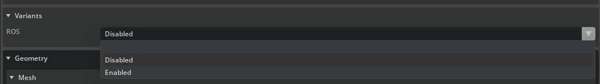
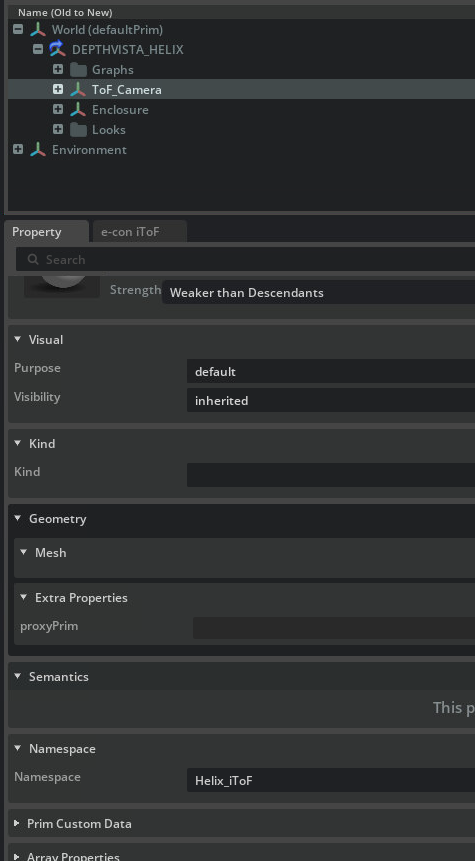
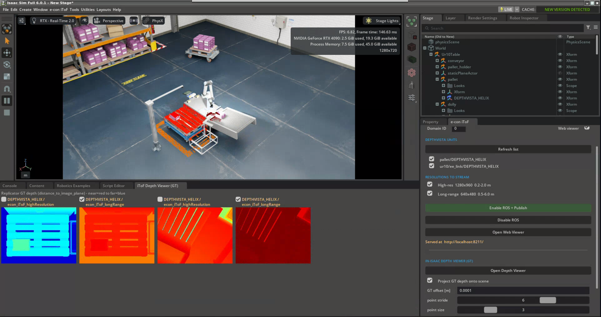
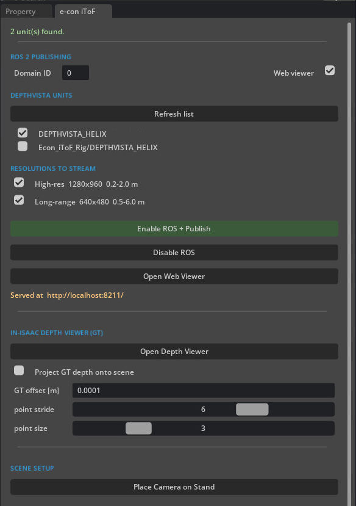
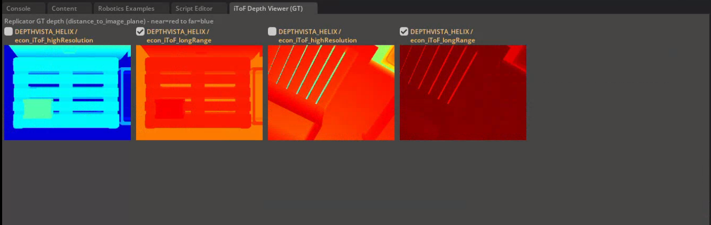

# e-con DepthVista Helix iToF — Isaac Sim

Adds the **e-con DepthVista Helix iToF** camera to Isaac Sim's supported camera and depth sensors,
with one-tap ROS 2 publishing, a browser depth viewer, and an in-Isaac ground-truth depth viewer —
all from a docked control window.

The package ships **two extensions**:

| Extension | Role |
|-----------|------|
| `econ.itof.menu` | Adds the DepthVista camera asset (**Create → Sensors → e-con**). |
| `econ.itof.ros`  | The **e-con iToF** control window: ROS 2 publishing, the browser viewer, the in-Isaac GT viewer, and a camera-on-a-stand test rig. |

## Requirements

- **NVIDIA Isaac Sim ≥ 5.1.0** — refer to the
  [installation guide](https://docs.isaacsim.omniverse.nvidia.com/latest/installation/install_workstation.html).
  Tested on 5.1.0, 6.0.0 and 6.0.1, on both Windows and Linux.

## Installation

Extract the `econ-isaac-sim` package, then run the installer from inside it.

**Linux**
```bash
cd econ-isaac-sim
./build.sh
```

**Windows**
```bat
cd econ-isaac-sim
build.bat
```

- Auto-detects Isaac Sim (prompts for the folder if not found).
- Installs **both extensions** into `extsUser` inside the Isaac Sim folder — self-contained, so the
  package folder can be deleted afterwards — and auto-loads them on every launch.
- Remove them with the [uninstaller](#uninstallation), not by deleting files manually.

If you have multiple Isaac Sim versions installed, or already know the path, set `ISAACSIM_PATH`
to skip auto-detection and target a specific install:

```bash
ISAACSIM_PATH=/home/econsy/ROBOTICS/downloads/isaacsim ./build.sh        # Linux
```
```bat
set ISAACSIM_PATH=C:\path\to\isaacsim & build.bat                       :: Windows
```

## Usage

1. Relaunch Isaac Sim if it is already running.
2. Open **Create → Sensors → Camera and Depth Sensors → e-con**.
3. Select **DepthVista Helix iToF** — added under `/World`.


The **e-con iToF** control window docks next to the **Property** panel (open it any time from the
**e-con iToF** menu → **Control Window**).


### Publishing without the extension (USD variant)

ROS 2 is baked into the camera USD as a variant. Set **ROS** to **Enabled** in *Property → Variants*
and press **Play** — the camera publishes its ROS 2 topics directly, with **no script or extension**.

 Variants" />

For **multiple cameras**, give each unit a distinct namespace so their topics don't conflict: after
enabling ROS, edit the **Namespace** on the unit's `ToF_Camera` in *Property → Namespace* — e.g.
`Helix_iToF_01`, `Helix_iToF_02`, … — so each camera's topics carry a different prefix.



The **econ.itof.ros** extension does all of this for you automatically — unit detection, per-unit
namespacing, and one-tap Enable/Disable — plus the browser and in-Isaac viewers for debugging.

## The e-con iToF control window

The **econ.itof.ros** extension adds an **e-con iToF** panel, docked next to *Property*, that drives
the whole pipeline from one place — ROS 2 publishing, browser and in-Isaac viewers, and ground
truth — with no scripting.



*Two DepthVista units streamed to ROS 2 from the panel (right); the in-Isaac depth viewer shows each
camera's ground-truth depth (bottom); the same depth is back-projected onto the scene geometry.*

### Panel



| Section | Control | Action |
|---------|---------|--------|
| ROS 2 publishing | **Domain ID**, **Web viewer** | ROS 2 domain for all topics; optionally open the browser preview when publishing. |
| DepthVista units | **Refresh list** + unit ticks | Detect units in the stage; choose which to publish (label is the name, or the path when names clash). |
| Resolutions to stream | **High-res**, **Long-range** | Stream 1280×960 (0.2–2.0 m) and/or 640×480 (0.5–6.0 m). |
| Publish | **Enable ROS + Publish**, **Disable ROS** | Enable the baked ROS variant on the selected units (green while active); press **Play** to stream. |
| Web viewer | **Open Web Viewer** | Browser depth + point-cloud preview at `http://localhost:8211/`. |
| Depth viewer (GT) | **Open Depth Viewer**, **Project GT depth onto scene** | In-Isaac ground-truth depth; optional scene overlay (GT offset / point stride / point size). |
| Scene setup | **Place Camera on Stand** | Drop a ready-to-use camera-on-a-stand test rig. |

### In-Isaac ground-truth depth viewer



One labelled tile per camera (unit / resolution), colour-mapped **near = red → far = blue** from the
Replicator `distance_to_image_plane` ground truth. The per-camera ticks select which cameras are
projected onto the scene.

## Camera variants

| File | Connector |
|------|-----------|
| `DEPTHVISTA_HELIX_GMSL.usd` | GMSL |
| `DEPTHVISTA_HELIX_USB.usd`  | USB |

- The menu exposes a single entry — **DepthVista Helix iToF** (the GMSL variant).
- For the USB variant, reference
  [`DEPTHVISTA_HELIX_USB.usd`](exts/econ.itof.menu/assets/DEPTHVISTA_HELIX_USB.usd) into your stage
  directly.

## ROS 2 streaming

Publishing is driven from the control window — no Script Editor. Each camera asset ships a pre-baked
`ROS` variant; enabling it composes the ready-made publisher graphs (namespaces + TF + IMU) in place.

1. Add one or more cameras (see [Usage](#usage)).
2. In the **e-con iToF** window: click **Refresh list**, tick the units to publish, choose the
   resolutions (**High-res** / **Long-range**), set the **Domain ID**, and click
   **Enable ROS + Publish** (it goes green while ROS is on).
3. Press **Play**. Click **Disable ROS** to stop.

> Uses the **ROS 2 Humble** libraries bundled with Isaac Sim (`isaacsim.ros2.bridge`) — no system
> ROS 2 is needed to publish. ROS 2 Humble is required only on the consumer side (RViz,
> `ros2 topic echo`).

Each unit is namespaced under its head prim. A single unit publishes under `/Helix_iToF`; additional
units get a deterministic suffix (`/Helix_iToF_01`, `/Helix_iToF_02`, …):

| Topic | Stream | Resolution | Range |
|-------|--------|-----------|-------|
| `/Helix_iToF/highres/{depth, camera_info, points}`   | High-resolution depth and point cloud | 1280×960 | 0.2–2.0 m |
| `/Helix_iToF/longrange/{depth, camera_info, points}` | Long-range depth and point cloud | 640×480 | 0.5–6.0 m |
| `/Helix_iToF/imu` | 6-axis IMU | — | 416 Hz |
| `/Helix_iToF/tf`  | Per-unit transform tree (`world → Helix_iToF`) | — | Per tick |
| `/clock` | Shared simulation clock (global, not namespaced) | — | Per tick |

- `highres` and `longrange` are two configurations of the same module, so they share one IMU and one
  TF frame per unit (a child of `world`).
- The **far-clip** is set per resolution (highres 2.0 m, longrange 6.0 m) so the two point clouds
  differ by range for every consumer (RViz and the viewers).

### Viewing in RViz

- Set the **Fixed Frame** to **`world`** (each unit's camera frame is a child of it).
- `/tf` is namespaced per unit, so run RViz remapping it to the unit you want:

```bash
ros2 run rviz2 rviz2 --ros-args -r /tf:=/Helix_iToF/tf -r /tf_static:=/Helix_iToF/tf_static
```


### Browser depth viewer

Click **Open Web Viewer** (or tick **Web viewer** before publishing). It serves at
`http://localhost:8211/`, independent of ROS — the address appears in the window once open, and the
default browser is opened automatically.

- **Depth tiles** — live depth, colour-mapped by distance (near = red, far = blue); a probe
  (cursor → last click → centre) reads the metric distance.
- **Point clouds** — per-camera checkboxes; interactive 3D (rotate / zoom / pan) with
  **Download .ply**.

The 3D view loads three.js from a CDN (needs internet); the 2D tiles work offline.


### In-Isaac ground-truth depth viewer

Click **Open Depth Viewer (GT)** for a window showing each camera's Replicator ground-truth depth
(`distance_to_image_plane`), colour-mapped near = red to far = blue. Tiles are labelled with the
camera prim and arrange side by side or stacked to fit the window.

- **Project GT depth onto scene** back-projects the depth as a depth-coloured point overlay in the
  viewport. Per-camera ticks in the viewer select which cameras project; **GT offset**, **point
  stride** and **point size** tune the overlay.

## Scene setup

**Place Camera on Stand** drops a camera-on-a-stand test rig (stand + arm + DepthVista camera) at the
origin, grouped under `/World/Econ_iToF_Rig` — grab that prim to move and aim the whole rig anywhere.

## Examples

- [**UR10 Palletizing**](examples/example1/README.md) — add two DepthVista Helix cameras (wrist
  and over-pallet) and a camera stand to Isaac Sim's UR10 Palletizing example,
  then stream to ROS 2 and the browser viewer.
- [**Nova Carter navigation**](examples/example2/README.md) — mount four
  DepthVista Helix cameras (front/back/left/right) on a Nova Carter, stream to ROS 2 under
  the robot's TF tree, and navigate two warehouse scenes (compact and full-size) with
  the Nav2 `carter_navigation` package.

## Uninstallation

```bash
./uninstall.sh          # Linux
uninstall.bat           # Windows
```

Restores the `.kit` files and removes both extensions. To target a specific install (multiple Isaac
Sim versions, or a known path), set `ISAACSIM_PATH` as with the installer:

```bash
ISAACSIM_PATH=/home/econsy/ROBOTICS/downloads/isaacsim ./uninstall.sh    # Linux
```
```bat
set ISAACSIM_PATH=C:\path\to\isaacsim & uninstall.bat                   :: Windows
```

## Notes

- Re-run the installer after reinstalling or updating Isaac Sim.
