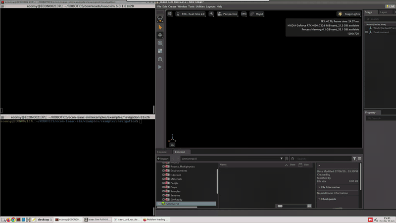
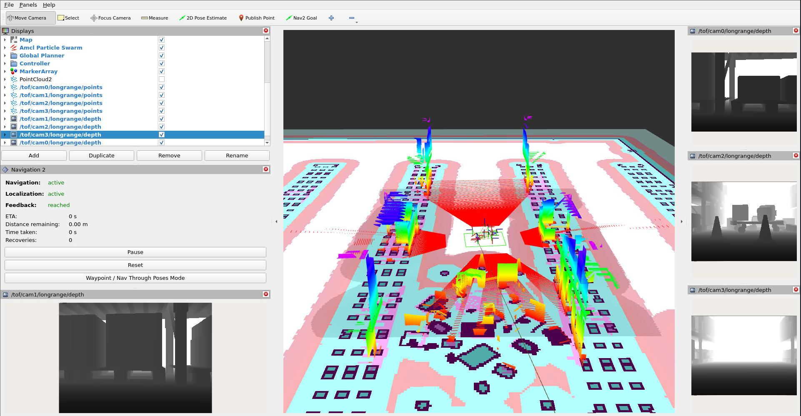
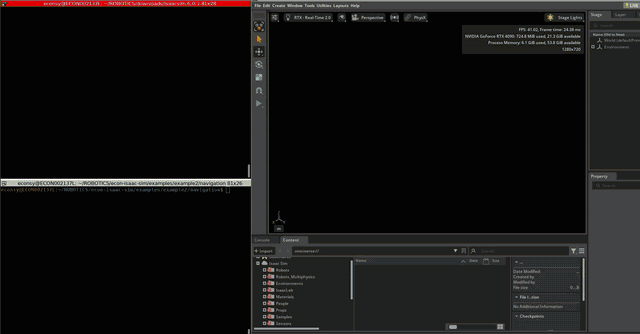

# Example 2 — DepthVista Helix cameras on Nova Carter for navigation

Isaac Sim's **Nova Carter** is an autonomous mobile robot (AMR) reference platform.
This example mounts four DepthVista Helix iToF cameras on its exterior
(front / back / left / right), streams their ROS 2 depth and point clouds alongside
the robot's own sensors, and feeds the fused point clouds into **Nav2** so the Carter
navigates a warehouse while perceiving obstacles with the iToF units.

Each camera is the menu's `DEPTHVISTA_HELIX_GMSL.usd`, parented under
`/World/Nova_Carter_ROS/chassis_link/sensors` at the mounted height (~0.35 m),
facing outward:

| Side | Translate (robot frame, m) | Faces | Rotate Z |
|------|----------------------------|-------|----------|
| Front | (0.117, 0.000, 0.346) | +X | -90 |
| Back  | (-0.581, 0.000, 0.346) | -X | 90 |
| Left  | (-0.355, 0.167, 0.346) | +Y | 0 |
| Right | (-0.355, -0.167, 0.346) | -Y | 180 |

## Provided assets

Ready-to-open USD stages are provided in [`assets/`](assets):

| Asset | What it is |
|-------|------------|
| [`carter_warehouse_nav_scene.usd`](assets/carter_warehouse_nav_scene.usd) | **Scene 1** — the Carter with the four iToF cameras in a compact warehouse. |
| [`full_warehouse_nova_carter_econ.usd`](assets/full_warehouse_nova_carter_econ.usd) | **Scene 2** — the same robot in the full-size warehouse. |
| [`Nova_Carter_ROS_econ_iToF.usd`](assets/Nova_Carter_ROS_econ_iToF.usd) | The **robot only** — a Nova Carter with the four iToF cameras attached, baked into a single stage for use in a custom scene. |

### Why two scenes

Two environments are provided so that navigation can be validated under contrasting
conditions:

- **Scene 1 — Compact warehouse** (`carter_warehouse_nav_scene.usd`): a small, wide and
  open layout with short aisles and ample clearance. Localisation and planning are
  straightforward, making it the recommended initial run for verifying the pipeline
  end to end.
- **Scene 2 — Full warehouse** (`full_warehouse_nova_carter_econ.usd`): a large, long
  and narrow layout with extended corridors and constrained aisles. It presents a more
  demanding case, requiring longer routes and relying on the 360° coverage of the four
  iToF cameras to maintain clearance from the shelving. It is intended to evaluate
  costmap and planner behaviour in a realistic, constrained environment.

Both scenes share the same robot, streaming script and Nav2 package; they differ only in
the map, parameters and launch file used, as listed in the table below.

## Requirements

- The extension installed, so the DepthVista Helix USD is available — see the
  [main README](../../README.md#installation).
- A ROS 2 Humble environment with the Nav2 stack installed.
- The [`carter_navigation`](navigation/src/carter_navigation) package built from the
  bundled [`navigation/`](navigation) workspace — see [Setup](#setup--build-the-navigation-workspace).

> Unlike the base extension — which streams through the ROS 2 libraries bundled with
> Isaac Sim — this example requires a full **external ROS 2 Humble installation**, because
> Nav2, RViz and the `carter_navigation` package run as standard ROS 2 nodes outside the
> simulator.

## Setup — build the navigation workspace

[`navigation/`](navigation) is a ROS 2 workspace containing the
[`src/carter_navigation/`](navigation/src/carter_navigation) package (launch files, maps,
parameters and RViz configurations) used to navigate the Carter in the warehouse maps.
The navigation configuration is as follows:

- The four iToF `/tof/camN/longrange/points` clouds drive a voxel obstacle layer in both
  the local and global costmaps.
- A 360° laser scan, synthesised from the 3D lidar, feeds AMCL localisation.

Build the workspace once, and source it in every terminal from which a launch file is run:

```bash
cd navigation && colcon build && source install/setup.bash
```

Each scene has its own launch file, map and parameter set:

| Scene | Launch file | Map | Params |
|-------|-------------|-----|--------|
| Compact warehouse (Scene 1) | `carter_navigation.launch.py` | `carter_warehouse_navigation.yaml` | `carter_navigation_params.yaml` |
| Full warehouse (Scene 2) | `carter_navigation_full_warehouse_econ.launch.py` | `full_warehouse_nova_carter_econ.yaml` | `carter_navigation_params_full_warehouse_nova_carter_econ.yaml` |

> The `carter_navigation` package is based on NVIDIA's
> [Isaac Sim ROS workspaces](https://github.com/isaac-sim/IsaacSim-ros_workspaces/tree/main/humble_ws/src/navigation/carter_navigation),
> extended here with the iToF voxel layers, tuned params, and the full-warehouse
> launch/map.

## Streaming script

After loading a scene in Isaac Sim, run
[`isaac_usd_ros_itof_example2_nova_carter.py`](isaac_usd_ros_itof_example2_nova_carter.py)
from the Script Editor to publish the camera topics. The script starts the simulation
automatically if it is not already playing, then detects the four units and publishes
depth, point cloud, camera_info and IMU topics for each.

It differs from the default [`../../ros2/isaac_usd_ros_itof.py`](../../ros2/isaac_usd_ros_itof.py)
in the following respects:

- Camera frames are parented under the Carter's `base_link`, joining the robot's
  `map → odom → base_link` transform tree instead of a separate `world` frame.
- Point clouds are published with `best_effort` reliability.
- The IMU is configured for a moving robot.

Published topics (four cameras → `cam0` front, `cam1` back, `cam2` left, `cam3` right):

```
$ ros2 topic list
/clock
/tf
/scan
/tof/cam0/longrange/camera_info
/tof/cam0/longrange/depth
/tof/cam0/longrange/points
/tof/cam0/imu
/tof/cam1/longrange/camera_info
/tof/cam1/longrange/depth
/tof/cam1/longrange/points
/tof/cam1/imu
/tof/cam2/longrange/camera_info
/tof/cam2/longrange/depth
/tof/cam2/longrange/points
/tof/cam2/imu
/tof/cam3/longrange/camera_info
/tof/cam3/longrange/depth
/tof/cam3/longrange/points
/tof/cam3/imu
```

## Run — Scene 1 (compact warehouse)

The Carter navigating the compact warehouse in RViz — the four iToF
point clouds populate the costmap and the planner routes around obstacles in real time:



1. In Isaac Sim, **File → Open** and select
   [`assets/carter_warehouse_nav_scene.usd`](assets/carter_warehouse_nav_scene.usd).
2. Run the [streaming script](#streaming-script) from the Script Editor; it starts the
   simulation automatically and begins publishing the camera topics.
3. In a sourced ROS 2 terminal, launch Nav2 with the compact-warehouse map:

   ```bash
   ros2 launch carter_navigation carter_navigation.launch.py
   ```
4. Set a **2D Goal Pose** in RViz; the Carter plans a path and drives to the goal,
   avoiding obstacles detected by the iToF cameras.

## Run — Scene 2 (full warehouse)

The four DepthVista Helix cameras on the Carter in the full-size warehouse:





1. In Isaac Sim, **File → Open** and select
   [`assets/full_warehouse_nova_carter_econ.usd`](assets/full_warehouse_nova_carter_econ.usd).
2. Run the [streaming script](#streaming-script) from the Script Editor (same script — it
   auto-detects the four units and starts the simulation automatically).
3. In a sourced ROS 2 terminal, launch Nav2 with the full-warehouse map and tuned params:

   ```bash
   ros2 launch carter_navigation carter_navigation_full_warehouse_econ.launch.py
   ```
4. Set a **2D Goal Pose** in RViz; the Carter plans a path and navigates through the
   long, narrow aisles.

## Bring your own scene

To evaluate the cameras in a custom environment, use
[`assets/Nova_Carter_ROS_econ_iToF.usd`](assets/Nova_Carter_ROS_econ_iToF.usd) — a
standalone Nova Carter with the four iToF cameras mounted and baked into a single stage.
Reference or add it to any Isaac Sim world and run the streaming script as described
above (it starts the simulation automatically); the published topics and TF tree remain
identical.

## Demo videos

- ▶ [**Compact warehouse navigation**](../../docs/Example2_Navigation/Videos/carter_warehouse_nav_scene.webm) — the Carter navigating with the iToF costmap in RViz.
- ▶ [**Full warehouse overview**](../../docs/Example2_Navigation/Videos/full_warehouse_nova_carter_econ.webm) — the four DepthVista Helix cameras on the Nova Carter in the full-size warehouse.
